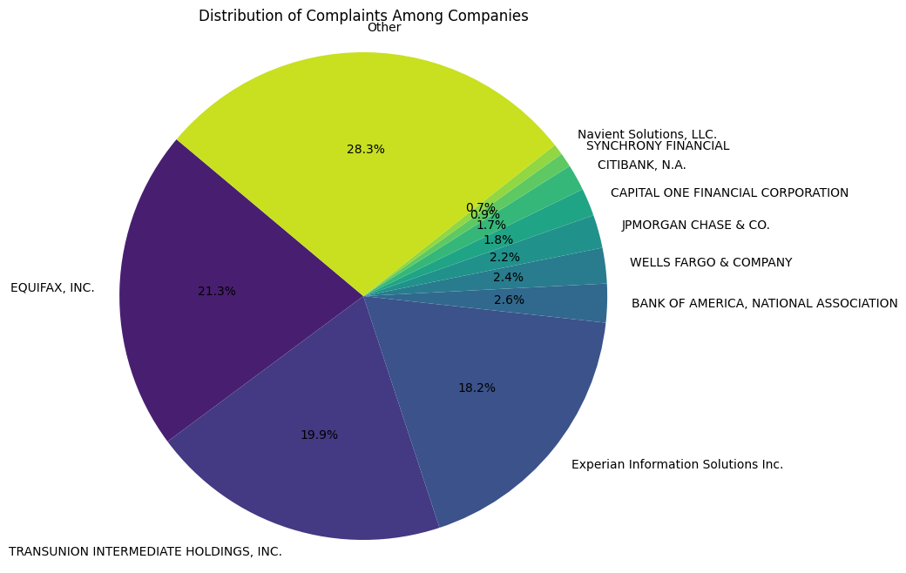
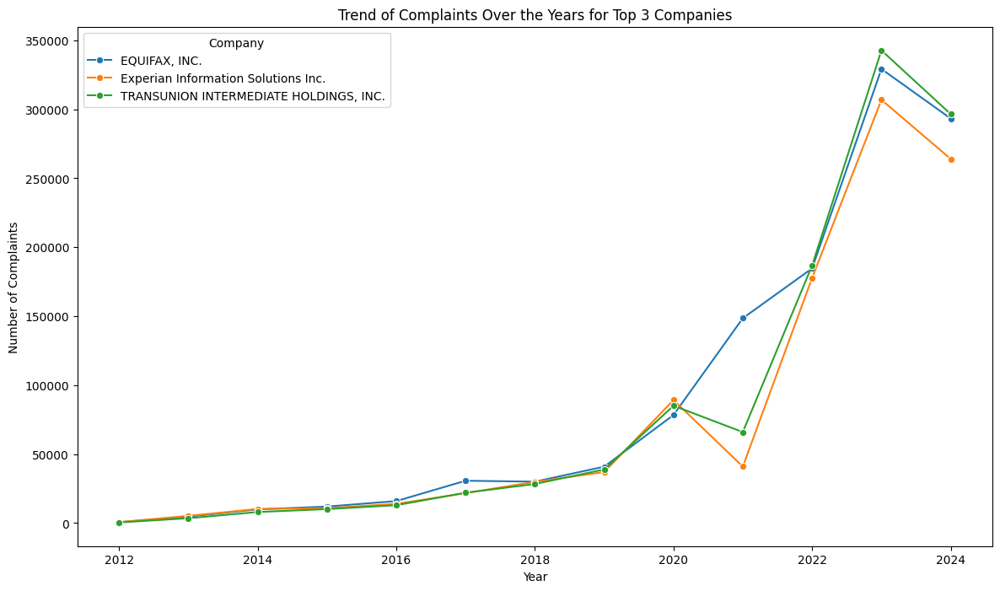
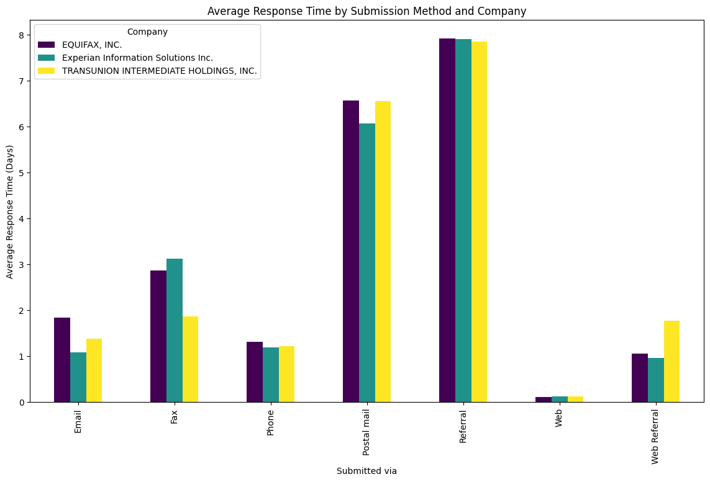

## Description
* This analysis is based on the consumer complaints recorded in the Consumer Complaint Database. This is a publicly available dataset available on catalog.data.gov. The Consumer Complaint Database is a collection of complaints about consumer financial products and services that is received by Consumer Financial Protection Bureau to companies for response. Complaints are published after the company responds, confirming a commercial relationship with the consumer, or after 15 days, whichever comes first.

* The data consists of 5,540,175 rows and 18 columns.
* you can view the whole article on [medium](https://medium.com/@pranav.agarw/unveiling-insights-a-deep-dive-into-credit-reporting-9878287af0a2)

